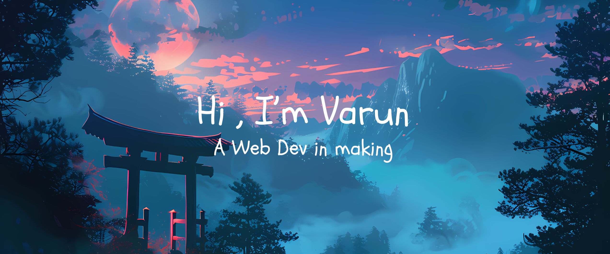

  

# 💫 About Me:
🔭 I’m currently working on **AI Telemedicine ChatBot** 
🌱 I’m currently studing **BE in Information Science and Engineering** 
💬 Ask me about on **varunal2003@gmail.com** 
⚡ Fun fact I do Digital Art and love Video Games

## 🌐 Socials:
 
 
 
 

# 💻 Tech Stack:
 
 
 
 
 
 
 
 
 
 
 
 
 
 
 
 

# 📊 GitHub Stats:

  

    

      
    

    

      
    

    <!-- 

      
    
 -->
  

<!-- ### ✍️ Random Dev Quote
 -->

---